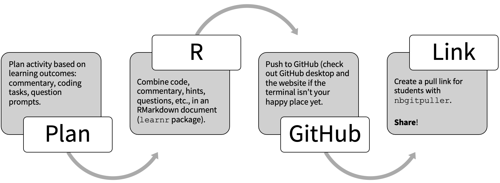
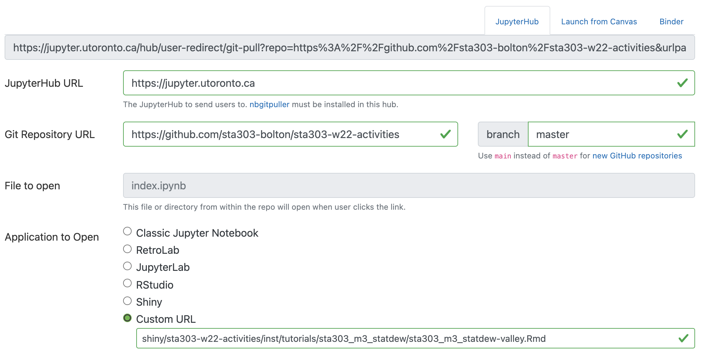

```{r setup, include=FALSE}
# R options
options(
  htmltools.dir.version = FALSE, # for blogdown
  show.signif.stars = FALSE,     # for regression output
  warm = 1
  )
# Set dpi and height for images
library(knitr)
opts_chunk$set(fig.height = 2.65, dpi =300, warning=FALSE, message=FALSE) 
# ggplot2 color palette with gray
color_palette <- list(gray = "#999999", 
                      salmon = "#E69F00", 
                      lightblue = "#56B4E9", 
                      green = "#009E73", 
                      yellow = "#F0E442", 
                      darkblue = "#0072B2", 
                      red = "#D55E00", 
                      purple = "#CC79A7")
# For nonsese...
#library(mdsr)
#library(emo)
library(tidyverse)
#library(gridExtra)
htmltools::tagList(rmarkdown::html_dependency_font_awesome())
### xaringan::inf_mr() -> use this for display within Rstudio
```

layout: true

.footerl[.tiny[https://bolton-cds-w22.netlify.app/]]

.footerc[.tiny[<span style="color: #1DA1F2;"> <i class="fab fa-twitter"></i></span>  @liza_bolton]]

---
# Caveat

I'm coming to you as a jack of ~~all~~ some trades and master of none. Nothing I'm about to talk about is necessarily the BEST way to do anything, but I hope seeing what I can manage inspires you to realize just how possible anything that catches your eye here is for you!

# Accessibility note

You can find my slides and images descriptions [here](https://blog.lizabolton.com/posts/2022-02-04-learnr-interactives-or-how-i-learned-to-stop-worrying-and-turn-my-students-into-pixelated-farmers/).

---
# Statdew Valley: my favourite use

```{r, out.width="55%", fig.align='center', echo=FALSE}
knitr::include_graphics("img/statdewvalley.png")
```

  <div class="btn" style="background: #612464; border: none; height: 50px; margin: 5px; text-align: center;"><span style="font-size: 20pt;"><a style="text-decoration: none;" href="https://jupyter.utoronto.ca/hub/user-redirect/git-pull?repo=https%3A%2F%2Fgithub.com%2Fsta303-bolton%2Fsta303-w22-activities&urlpath=shiny%2Fsta303-w22-activities%2Finst%2Ftutorials%2Fsta303_m3_statdew%2Fsta303_m3_statdew-valley.Rmd&branch=master"><span style="color: #ffffff;"><strong>Open the activity on the JupyterHub</strong></span></span></span></a></div>
          </div>

---
## (From the activity) Welcome to Statdew Valley!

You're grandmother has asked you to take over her old farm plot in _Statdew Valley_. Armed with statistical knowledge, you set out to begin your new life!

There are two of datasets for you to analyze to better understand the operation of your farm.

Note: The final 'hint' for code chunks will be the solution.

_Yes, this is totally an homage to [Stardew Valley](https://www.stardewvalley.net/). Have I played? No, but à la Girlfriend Reviews on YouTube, this is based on "what it's like to live with someone who plays Stardew Valley."_

---
## What is in this activity?

.pull-left[
- [Optional] image manipulation with R ( to create a 16 (ish) bit player avatar from a picture)  
  - You can use R for so much more than just running regressions!
- Areas to write code (with hints and solutions)
- Multi-choice questions (ungraded) with commentary so learners can check if they are on the right track, but also to bring attention to important features
- Egregious bee puns and B(ee)TS references]

.pull-right[
```{r, out.width="100%", fig.align='center', echo=FALSE}
knitr::include_graphics("img/lb-example.png")
```
]


---
background-image: url(https://media0.giphy.com/media/3oEjHGZQS3Xvo94aty/giphy.gif)
background-position: 50% 50%
background-size: 100%
class: center, bottom, fullscale, inverse

# You can't fight in here. This is the War Room!

---
## But shouldn't the learners learn to code \~properly\~ in R?

--
__Of course!__

--
It isn't very impressive for our students to go to their future employers/grad schools and say, sure I can code in R, but only if you set up a nice interactive template for me. I don't know how to load data, format outputs or conduct a full analysis.  
<br>

--
A big priority in all the courses I am involved with is ensuring students can write up useful, reproducible reports with RMarkdown. BUT these types of of interactive activities clear out the other considerations and let learners focus in on concepts and highlight specific skills, functions, etc.
<br>
<br>

So, no (unnecessary) coding in here. This is the Code Tutorial!


---
# Course context (STA303)

.midi[
<span style="color: #612464;"><i class="fas fa-file-alt"></i> [Syllabus](https://sta303-bolton.github.io/sta303-w22-courseguide/other-files/STA303-1002_W22_syllabus.pdf)</span>

.pull-left[

Students engage with __asynchronous activities__, BEFORE synchronous activities.

Goals of __synchronous classes__: develop group problem solving skills, practise talking about stats, build a sense of class community and focus attention on tricky concepts and assessments.

Some learners find it hard to motivate themselves with asynch content, so making it more interactive can help.

]

.pull-right[
### Our uses

- Asynchronous tutorials/activities  
   - Students can self pace  
   - Prompted to check their understanding actively, not passively
- Interactive activities for team-based learning 
  - I set up an activity with learnr on the JupyterHub
  - [Team Up!](https://q.utoronto.ca/courses/46670/pages/integration-team-up-for-instructors)
]]

---
# Why this makes your life easier and you should totally try it

- __`learnr`__: Make fun interactive activities, using the coding skills you already have (or are working on developing).

- __JupyterHub__: No fussing with students needing to download files and navigate the (sometimes) terrifying permissions, files structures and other pains of their local machine. **You provide a link and the activity loads in their browser.**

- __All__: Easy to improve, remix and reuse semester to semester. Unleash your creativity.

---
# (Possible) barriers

- __Git & GitHub__: You don't have to be a Git power user to make this work for you. GitHub desktop and uploading straight to website are perfectly reasonable workflows. 
- __HTML & CSS__: There are certain things that can be easier or more easily customized if you have a basic comfort with HTML and CSS, but these are pretty easy to pick up as you go from the resources and other people's templates,
- __Not an R user__: Become an R user! 😉 

---
## Things that can go wrong

.pull-left[
### Tech
- Rmd files directly in the student's home directory
  - This was a whole thing
- Mysterious connection issues and loading lags
]

.pull-right[
### Students

- This is not a PDF. This means that for some students this is outside their comfort zone or preferences for note taking. 
  - Suggestion: Talk about how you're intending for them to use these activities and learn from them. Connect students to [learning strategists](https://studentlife.utoronto.ca/service/learning-strategist-appointments/) who can coach them on effective note taking.
]

---
### Assessments: Abundance of caution

.midi[There are a few common problems that are easy to teach students to solve, but there are occasionally connection issues that I can't get to the bottom of.  With this in mind, I don't use these activities for __timed assessments__, other than the optional, graded group Team Up! activities, where usually one team member can make it work (and Team Up! activities are just _one_ way to earn the possible marks).]

```{r, out.width="35%", fig.align='center', echo=FALSE}
knitr::include_graphics("https://pbs.twimg.com/media/ETGENaMWAAA7pg_?format=jpg&name=medium")
```


.footnote[A *bun* dance...of caution]

---
# The workflow

```{r, out.width="100%", fig.align='center', echo=FALSE}

```

---
## Git and GitHub for R users

```{r, out.width="50%", fig.align='center', echo=FALSE}
knitr::include_graphics("https://happygitwithr.com/img/watch-me-diff-watch-me-rebase-smaller.png")
```


  <div class="btn" style="background: #612464; border: none; height: 50px; margin: 5px; text-align: center;"><span style="font-size: 20pt;"><a style="text-decoration: none;" href="https://happygitwithr.com/index.html"><span style="color: #ffffff;"><strong>Happy Git with R</strong></span></span></span></a></div>
          </div>

"Happy Git and GitHub for the useR" was written by Jenny Bryan, the STAT 545 TAs, Jim Hester.

---
## nbgitpuller

```{r, out.width="80%", fig.align='center', echo=FALSE}

```

---
## nbgitpuller (key text)

- JupyterHub URL: `https://jupyter.utoronto.ca`   
- Branch: `master` .highlight[(check this on your GitHub! Use `main` instead of `master` for [new GitHub repositories](https://github.blog/changelog/2020-10-01-the-default-branch-for-newly-created-repositories-is-now-main/))]  
- Git Repository URL: `https://github.com/sta303-bolton/sta303-w22-activities` .highlight[should be the top-level of the repo on github, not a subfolder]  
- Custom URL: `shiny/sta303-w22-activities/inst/tutorials/sta303_m3_statdew/sta303_m3_statdew-valley.Rmd` .highlight[structure should be: `shiny/repo-name/path-to-rmd/rmd-file.rmd`]

---
# Tips

- Plan to spend some time in a first class (or likely two) showing students the main troubleshooting options. Here are my top things to check:
  - Close all other interactives
  - Check no there are no naked Rmd in your Home Directory
  - Delete and pull again
  - Go in the back way 

---
# MarkUs

So now  your students know all this great code...how do you set and mark meaningful assessments of their skills and knowledge?  
<br>
--

### MarkUs!

--
I'm still very new to MarkUs, STA303's first assessments are just beginning marking on it _today_ (check out the instructions for their [mini-portfolio here](https://sta303-bolton.github.io/sta303-w22-courseguide/mini-portfolio.html)). 

I am so excited about the potential and how well it matches my course's needs. Watch this space!

---
# Links

- [`learnr` documentation](https://rstudio.github.io/learnr/)  
- [JupyterHub support (UofT)](https://act.utoronto.ca/jupyterhub-support/)  
- [JupyterHub guide with gifs I made for my students](https://rstudio-with-jupyerhub-uoft.netlify.app/)
- [`nbgitpuller` for making pull links](https://jupyterhub.github.io/nbgitpuller/link)  
- [Happy Git with R](https://happygitwithr.com/index.html)
- [Statdew Valley interactive](https://jupyter.utoronto.ca/hub/user-redirect/git-pull?repo=https%3A%2F%2Fgithub.com%2Fsta303-bolton%2Fsta303-w22-activities&urlpath=shiny%2Fsta303-w22-activities%2Finst%2Ftutorials%2Fsta303_m3_statdew%2Fsta303_m3_statdew-valley.Rmd&branch=master)
- [StatDew Valley on GitHub](https://github.com/sta303-bolton/sta303-w22-activities/tree/master/inst/tutorials/sta303_m3_statdew)

---
class: inverse, middle, center

# 🎵 We'll meet again, don't know where, don't know when 🎵

But email me in the meantime: liza.bolton@utoronto.ca

```{r eval = FALSE, echo = FALSE}

pagedown::chrome_print("bolton-cds-ed-cop-w22.html", wait = 20)

```

